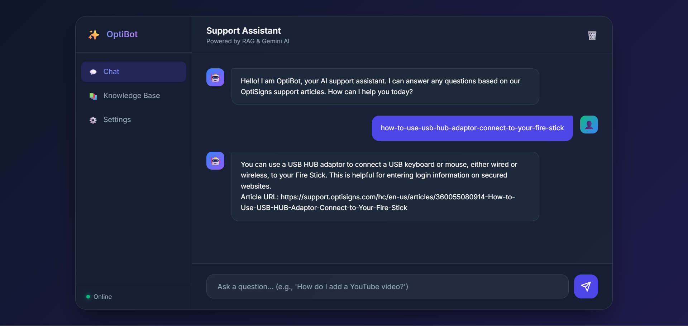

# 🤖 OptiBot — AI Customer Support Chatbot

An intelligent RAG-based customer support chatbot for [OptiSigns](https://www.optisigns.com/). It automatically scrapes support articles from Zendesk, chunks and embeds them using Google Gemini, stores vectors in Qdrant Cloud, and answers customer questions with AI-powered semantic search.

## ✨ Features

- 🕷️ **Smart Web Scraper**: Fetches articles from OptiSigns Zendesk support center with **rotating pagination** (30 articles/day, auto-advances to next page)
- 🔄 **Delta Detection**: Only processes new/updated articles using SHA-256 hashing — saves API costs
- 🧠 **RAG Pipeline**: Retrieval-Augmented Generation using Qdrant Vector Database + Google Gemini API
- ☁️ **Cloud-Native**: Vectors stored on **Qdrant Cloud** (free tier) — no local database needed
- ⏰ **Fully Automated**: GitHub Actions runs daily at 7:00 AM (Vietnam time) — zero manual work
- 🐳 **Dockerized**: Local development supported via Docker Compose

## 🏗️ Architecture

```
Zendesk API ──→ Scraper ──→ Chunking ──→ Gemini Embedding ──→ Qdrant Cloud
                                                                    ↓
                                              User Question ──→ Semantic Search
                                                                    ↓
                                                        Gemini LLM ──→ Answer
```

## 🚀 Setup

### 1. Clone & Install
```bash
git clone https://github.com/trantuansang2411/sangTran_github.git
cd sangTran_github
pip install -r requirements.txt
```

### 2. Configure Environment
```bash
cp .env.sample .env
```

Edit `.env` with your credentials:
```env
GEMINI_API_KEY=your_gemini_api_key
QDRANT_URL=https://your-cluster.cloud.qdrant.io:6333
QDRANT_API_KEY=your_qdrant_api_key
```

### 3. Get API Keys
- **Gemini API Key**: [Google AI Studio](https://aistudio.google.com/apikey)
- **Qdrant Cloud**: [cloud.qdrant.io](https://cloud.qdrant.io/) — Create a free cluster, then get your URL and API Key

## 💻 Run Locally

### Full pipeline (Scrape + Embed + Upload to Qdrant):
```bash
python main.py
```

### Test the AI chatbot:
```bash
python test_assistant.py
```

### Scrape only (without uploading):
```bash
python scrape.py
```

## 🐳 Run with Docker

```bash
docker compose up -d qdrant              # Start local Qdrant (for development)
docker compose run --rm optibot python main.py          # Run pipeline
docker compose run --rm optibot python test_assistant.py # Chat with AI
```

## ⚡ Automated Daily Pipeline (GitHub Actions)

The system runs automatically every day via GitHub Actions:

- **Schedule**: Daily at `00:00 UTC` (7:00 AM Vietnam time)
- **Config**: [`.github/workflows/daily-scraper.yml`](.github/workflows/daily-scraper.yml)
- **Logs**: Check the **Actions** tab in the GitHub repo

### Setup GitHub Secrets:
Go to repo **Settings** → **Secrets and variables** → **Actions** → Add these 3 secrets:

| Secret Name | Value |
|---|---|
| `GEMINI_API_KEY` | Your Google Gemini API key |
| `QDRANT_URL` | Your Qdrant Cloud cluster URL |
| `QDRANT_API_KEY` | Your Qdrant Cloud API key |

### How Automation Works:
1. GitHub Actions wakes up daily at 7:00 AM
2. Reads `scrape_state.json` to know which page to scrape next
3. Fetches 30 new articles from the current page
4. Chunks text → Embeds with Gemini → Uploads vectors to Qdrant Cloud
5. Saves state (`scrape_state.json`, `article_hashes.json`) back to GitHub
6. Next day, automatically moves to the next page

## 🧩 Key Technologies

| Component | Technology |
|---|---|
| Language | Python 3.11 |
| LLM | Google Gemini API (gemini-2.5-flash) |
| Embedding | gemini-embedding-001 (3072 dimensions) |
| Vector Database | Qdrant Cloud (Free Tier) |
| CI/CD | GitHub Actions |
| Containerization | Docker & Docker Compose |

## 📁 Project Structure

```
├── main.py                  # Orchestrator — runs full pipeline
├── scrape.py                # Zendesk article scraper with pagination
├── upload_vectorstore.py    # Chunking + Embedding + Qdrant upload
├── test_assistant.py        # RAG chatbot (Semantic Search + Gemini LLM)
├── requirements.txt         # Python dependencies
├── .env.sample              # Environment template
├── docker-compose.yaml      # Docker services configuration
├── Dockerfile               # Container build instructions
├── article_hashes.json      # Delta detection cache (auto-generated)
├── uploaded_files.json      # Upload tracking cache (auto-generated)
├── scrape_state.json        # Pagination state (auto-generated)
└── .github/workflows/
    └── daily-scraper.yml    # GitHub Actions daily cron job
```

## 📸 Screenshot


