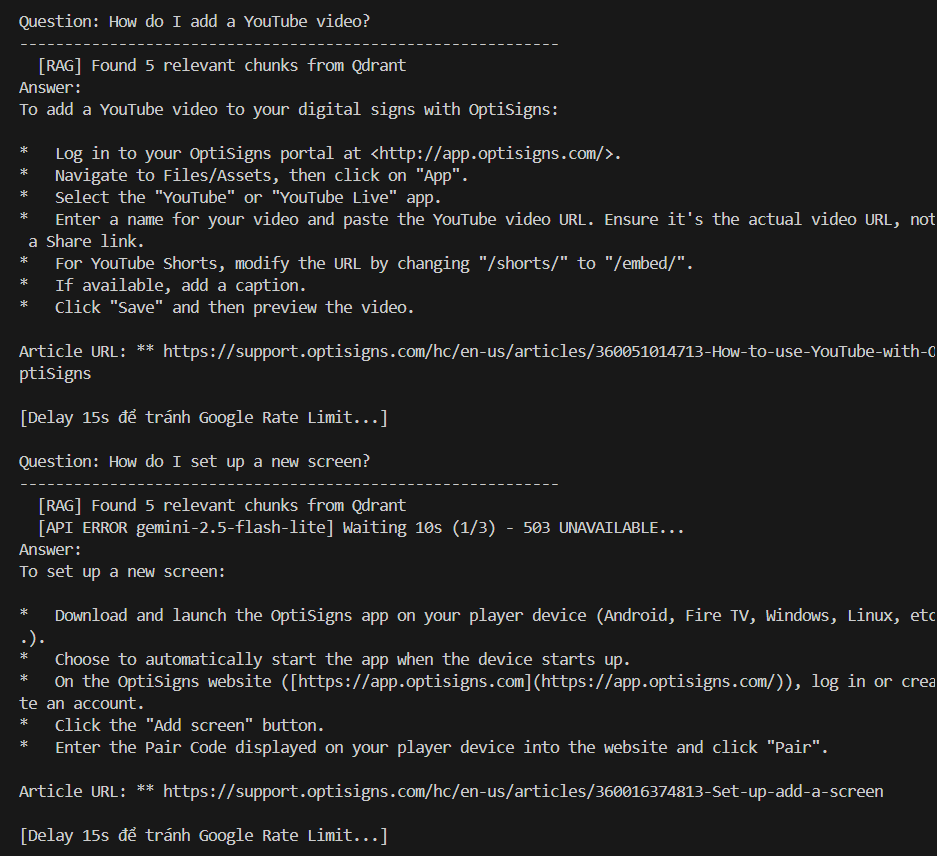

# AI Support Bot Clone

A mini-clone of OptiBot — customer support chatbot for OptiSigns. It scrapes support articles, converts them to Markdown, and uploads to Google Gemini Files API for intelligent Q&A.

## Features

- 🕷️ **Web Scraper**: Fetches articles from OptiSigns Zendesk support center
- 🔄 **Delta Detection**: Only uploads new/updated articles (using SHA-256 hashing)
- 🤖 **AI Assistant**: Powered by Google Gemini API using uploaded Markdown files as context
- ⏰ **Daily Job**: Automated daily scraping via GitHub Actions cron job
- 🐳 **Dockerized**: One command to build and run

## Setup

1. Clone repo:
   ```bash
   git clone <repo-url>
   cd <repo-name>
   ```

2. Copy environment template:
   ```bash
   cp .env.sample .env
   ```

3. Add your API key to `.env`:
   ```
   GEMINI_API_KEY=AIzaSy-your-key-here
   ```

4. Install dependencies:
   ```bash
   pip install -r requirements.txt
   ```

## Run Locally

### First time (scrape all articles + upload to Gemini):
```bash
python main.py
```

### Scrape only (without uploading):
```bash
python scrape.py
```

### Upload only (existing articles to Gemini Files API):
```bash
python upload_vectorstore.py
```

## Run with Docker

```bash
docker build -t optibot .
docker run -e GEMINI_API_KEY=your_key optibot
```

## Daily Job

- **Platform**: GitHub Actions
- **Schedule**: Daily at 00:00 UTC
- **Config**: [`.github/workflows/daily-scrape.yaml`](.github/workflows/daily-scrape.yaml)
- **Logs**: Check the "Actions" tab in GitHub repo

### Setup GitHub Secrets:
1. Go to repo **Settings** → **Secrets and variables** → **Actions**
2. Add `GEMINI_API_KEY`

## File Processing Strategy

Files are uploaded as-is to the Google Gemini Files API. Each Markdown file represents one support article, keeping the context intact per article. The Gemini models can ingest these files directly into their context window for precise retrieval and generation.

## Delta Detection

The scraper uses **SHA-256 hashing** to detect changes:
- On each run, it hashes the content of every article
- Compares against `article_hashes.json` from the previous run
- Only uploads articles that are **new** or have **changed content**
- Logs counts: added, updated, skipped

## Screenshot

